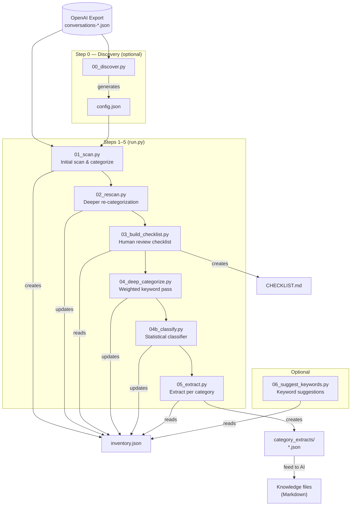
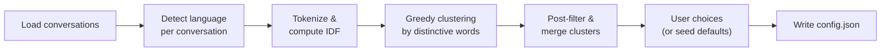
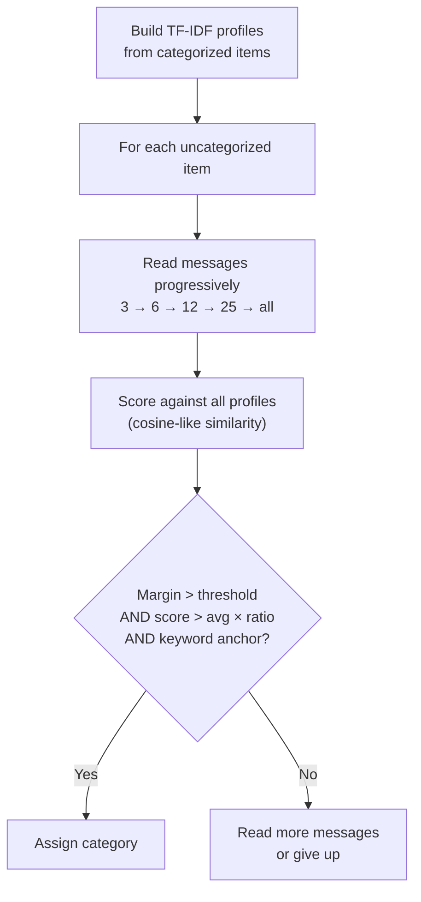

# AIKnowledgeDistill

Turn a raw ChatGPT/OpenAI data export into structured, categorized knowledge files ready for any AI assistant.

**No external dependencies.** Python 3.10+ stdlib only.

---

## What It Does

You exported your ChatGPT history — now what? It's a blob of hundreds (or thousands) of conversations across years, topics, and languages. This pipeline:

1. **Discovers** what topics your conversations cover (no predefined categories needed)
2. **Categorizes** every conversation using multi-pass keyword + statistical classification
3. **Triages** what's worth keeping vs. trivial or outdated
4. **Extracts** valuable content per category into structured JSON
5. Produces files ready to feed to an AI for **distillation** into reusable knowledge

---

## Quick Start

### Get Your Export

1. ChatGPT → Settings → Data Controls → Export Data
2. Wait for the email, download and unzip
3. You'll have a folder with `conversations-000.json`, `conversations-001.json`, etc.

### Run Discovery (Recommended First Step)

```bash
# Interactive — asks questions about language, reviews discovered topics
python 00_discover.py --backup /path/to/OpenAI-Export

# Non-interactive — reads answers from a seed file
python 00_discover.py --seed seed.json --output myrun/config.json
```

This scans ALL conversations with zero configuration, detects languages, finds topic clusters, and generates a `config.json`.

### Run the Pipeline

```bash
python run.py --config myrun/config.json
```

Runs steps 01 through 05 in sequence. Output lands in the same directory as your config file.

### Review & Refine

```bash
# Check the generated checklist
cat myrun/CHECKLIST.md

# Optional: get keyword suggestions for remaining uncategorized items
python 06_suggest_keywords.py --config myrun/config.json
```

---

## Pipeline Overview



### Data Flow

| File | Created by | Updated by | Read by |
|------|-----------|-----------|---------|
| `config.json` | `00_discover.py` or manual | User edits | All steps 01–06 |
| `inventory.json` | `01_scan.py` | `02`, `04`, `04b` | `03`, `05`, `06` |
| `CHECKLIST.md` | `03_build_checklist.py` | — | Human review |
| `category_extracts/*.json` | `05_extract.py` | — | AI distillation |

---

## User-Facing Features

### Language Detection

The discovery step detects the language of each conversation (English, Dutch, French, German, Spanish) using function word frequency analysis.

**Language strategy** (mandatory choice, set interactively or via config):

| Strategy | Behavior | Requires `target_language` |
|----------|----------|---------------------------|
| `unified` | Auto-detects the dominant language, instructs AI to translate everything to it | No (auto-detected) |
| `preserve` | Split output files by language (e.g., `infra-en.json`, `infra-nl.json`) | No |
| `translate` | Single file per category, AI translates everything to a specified target language | **Yes** |
| `multilingual` | Single file per category, AI includes both original + translation | **Yes** |

### Topic Discovery

Categories are **discovered from your data**, not predefined. The algorithm:

- Tokenizes conversation content (titles + first 10 messages)
- Computes word distinctiveness using IDF (inverse document frequency)
- Groups conversations sharing distinctive vocabulary into clusters
- Filters out generic function words and conversational filler

A user chatting about cars gets categories like "motor/turbo/chassis". Someone into electronics gets "arduino/esp32/resistor".

### Triage System

Every conversation gets a triage status:

| Status | Meaning | Rule |
|--------|---------|------|
| `skip` | Trivial, too short to contain knowledge | ≤ `skip_threshold` messages (default: 2) |
| `skip-candidate` | Short, probably not worth processing | ≤ `skip_candidate_threshold` messages (default: 5) |
| `review` | Worth reviewing — likely contains knowledge | 6+ messages |
| `outdated` | Generic how-to that current AI knowledge supersedes | Matches outdated indicators + how-to signals |
| `done` | Already processed in a previous run | Title in `already_processed` list |

### Multi-Pass Categorization

Each pass gets progressively deeper into conversation content:

| Pass | Script | What it reads | How it matches |
|------|--------|--------------|----------------|
| 1 | `01_scan.py` | Title + first user message | Simple keyword count |
| 2 | `02_rescan.py` | Title + first 3 user messages | Keyword count with content |
| 3 | `04_deep_categorize.py` | Title + first 5 user + 3 assistant messages | Weighted scoring (strong=3pts, medium=1pt) |
| 4 | `04b_classify.py` | Progressive: 3→6→12→25→all messages | TF-IDF statistical profiles |

### Keyword Matching

Short keywords (≤4 chars) like `sso`, `ssh`, `api` use **word boundary matching** to prevent false positives inside longer words (e.g., "sso" won't match "espresso"). Longer keywords use substring matching.

---

## Configuration Reference

### Full Config (`config.json`)

```jsonc
{
  // Path to unzipped OpenAI data export
  "backup_dir": "/path/to/OpenAI-Export",

  // Language handling for output files (required)
  // Options: "unified" | "preserve" | "translate" | "multilingual"
  "language_strategy": "translate",

  // Target language when strategy is "translate" or "multilingual"
  // ISO 639-1: "en", "nl", "de", "fr", "es"
  "target_language": "en",

  // Topic categories with keywords
  // Can be auto-generated by 00_discover.py or hand-crafted
  "categories": {
    "infrastructure": {
      "strong": ["docker", "traefik", "kubernetes"],  // 3 points each
      "medium": ["server", "linux", "deploy"]          // 1 point each
    },
    "cooking": ["recipe", "oven", "ingredients"]       // flat list (1pt each)
  },

  // Triage rules
  "triage": {
    "skip_threshold": 2,              // messages ≤ this → triage "skip"
    "skip_candidate_threshold": 5,    // messages ≤ this → triage "skip-candidate"
    "outdated_before": "2024-06-01",  // date cutoff for outdated detection
    "outdated_indicators": {          // keyword → reason label
      "docker": "Docker setup",
      "nginx": "Nginx config"
    },
    "howto_signals": [                // if indicator + signal → "outdated"
      "how to", "setup", "install", "configure"
    ]
  },

  // Conversation titles already distilled in a previous run
  "already_processed": ["Some Chat Title", "Another One"]
}
```

### Seed Config (`seed.json`) — for Non-Interactive Discovery

Minimal file to drive `00_discover.py` without interactive prompts:

```jsonc
{
  "backup_dir": "/path/to/OpenAI-Export",  // required
  "language_strategy": "translate",         // required: unified|preserve|translate|multilingual
  "target_language": "en",                 // required when strategy is translate or multilingual
  "min_cluster_size": 8,                   // optional, default: 5
  "triage": {                              // optional, default: sensible defaults
    "skip_threshold": 2,
    "skip_candidate_threshold": 5,
    "outdated_before": "2024-06-01"
  }
}
```

### Config Parameters Quick Reference

| Parameter | Where | Default | Effect |
|-----------|-------|---------|--------|
| `backup_dir` | config/seed | — | Path to OpenAI export (conversations-*.json) |
| `language_strategy` | config/seed | **required** | unified, preserve, translate, or multilingual |
| `target_language` | config/seed | — | ISO 639-1 code (required for translate/multilingual) |
| `min_cluster_size` | seed | `5` | Minimum conversations to form a topic cluster |
| `skip_threshold` | triage | `2` | Messages ≤ this → skip |
| `skip_candidate_threshold` | triage | `5` | Messages ≤ this → skip-candidate |
| `outdated_before` | triage | `"2024-06-01"` | Date cutoff for outdated generic how-to |
| `already_processed` | config | `[]` | Conversation titles to mark as done |

---

## Script Details

### `00_discover.py` — Topic Discovery

**Purpose:** Scan raw export, detect languages, discover topic clusters, generate config.

**Modes:**
- Interactive: `--backup /path` — asks questions, shows clusters for review
- Config-driven: `--seed seed.json` — reads answers from seed file

**Phases:**



**Internal Parameters & Thresholds:**

| Parameter | Value | Purpose |
|-----------|-------|---------|
| Max corpus frequency | 5% of conversations | Words in >5% of conversations are too generic to cluster on |
| Lift threshold | 3.0x | A keyword must appear 3x more in its cluster than in the corpus |
| Min keywords per cluster | 3 total, 2 with length ≥6 | Ensures clusters have domain-specific terms |
| Domain word min length | 6 characters | Short words tend to be function words |
| Cluster merge threshold | 2+ shared keywords | Merges overlapping clusters |
| Min words for language detection | 10 | Below this, language is "unknown" |
| Min language marker hits | 3 | Need ≥3 function word matches to assign language |
| Messages read per conversation | 10 (800 chars each) | Balance between coverage and speed |

**Language Detection Method:**
Counts matches against known function word sets per language (LANG_MARKERS). Each language has ~30-50 marker words (e.g., English: "the", "was", "which", "through"; Dutch: "een", "het", "niet", "eigenlijk"). Highest match count wins if ≥3 hits.

**Clustering Algorithm:**
1. Build word sets per conversation (tokenize, filter stop words + generic words, min 4 chars)
2. Compute IDF per word: `log(N / (1 + doc_freq))`
3. Score anchor candidates: `doc_freq × IDF²` (balances frequency with distinctiveness)
4. Greedy: take highest-scoring anchor word, find all conversations containing it
5. For each cluster: find co-occurring words (in ≥40% of cluster items)
6. Rank by lift: `(fraction_in_cluster / fraction_in_corpus)`, keep words with lift ≥3.0
7. Post-filter: require ≥2 domain words (length ≥6, no generic suffixes)
8. Merge: clusters sharing ≥2 keywords get combined

**Interactive Mode Features:**
- Shows all discovered clusters with sample titles
- For each cluster: accept (give it a name), skip, or merge with another cluster number
- Add manual categories after discovery
- Choose language strategy and target language

---

### `01_scan.py` — Initial Scan & Categorization

**Purpose:** Parse all conversations, build the inventory, assign initial categories and triage.

**Input:** `config.json` (categories, triage rules, already_processed)
**Output:** `inventory.json` (one entry per conversation)

**What it reads per conversation:** Title + first user message (500 chars)

**Categorization:** Simple keyword count — category with most keyword hits wins. Supports both `{strong, medium}` keyword dicts and flat keyword lists (both score 1 point per hit at this stage).

**Triage rules applied:**
- `msg_count ≤ skip_threshold` → `skip`
- `msg_count ≤ skip_candidate_threshold` → `skip-candidate`
- Title in `already_processed` → `done`
- Matches `outdated_indicators` + `howto_signals` → `outdated`
- Otherwise → `review`

**Custom GPT detection:** Flags conversations that had a system message >100 characters (indicates Custom GPT usage).

**Inventory entry structure:**
```json
{
  "id": "conversation-uuid",
  "title": "ESP32 LED Setup",
  "date": "2024-03-15",
  "message_count": 12,
  "category": "hardware",
  "triage": "review",
  "outdated_reason": null,
  "first_user_preview": "How do I connect...",
  "custom_gpt": false
}
```

---

### `02_rescan.py` — Deeper Re-categorization

**Purpose:** Improve categorization by reading actual conversation content, not just titles.

**Input:** `inventory.json`, `config.json`, raw conversations
**Output:** Updated `inventory.json`

**What it reads:** Title + first 3 user messages (full text)

**Differences from step 01:**
- Reads 3 user messages instead of just the first
- Re-categorizes ALL items (not just uncategorized), except `triage=done`
- Can change an existing category if a better match is found
- Additional outdated detection: old generic tech Q&A (date < cutoff, ≤10 messages, matches generic patterns like "what is", "explain", "difference between")

**Outdated detection rules:**
1. `triage ∈ {review, skip-candidate}` AND matches `outdated_indicators` + `howto_signals` → outdated
2. `triage ∈ {review, skip-candidate}` AND `date < outdated_before` AND `msg_count ≤ 10` AND matches generic Q&A patterns + tech keywords → outdated

---

### `03_build_checklist.py` — Review Checklist

**Purpose:** Generate a human-readable Markdown checklist for manual review.

**Input:** `inventory.json`
**Output:** `CHECKLIST.md`

**Format:** Grouped by category, then by triage status. Uses checkbox notation:
- `[x]` — done/outdated (no action needed)
- `[ ]` — review/skip-candidate (needs human review)
- `[-]` — skip (trivial)

Includes summary tables with category and triage distribution counts.

---

### `04_deep_categorize.py` — Weighted Keyword Pass

**Purpose:** Categorize remaining uncategorized items using weighted scoring on deeper content.

**Input:** `inventory.json`, `config.json`, raw conversations
**Output:** Updated `inventory.json`

**What it reads:** Title + first 5 user messages (500 chars each) + first 3 assistant messages (300 chars each)

**Scoring:** Weighted keyword matching:
- `strong` keywords: **3 points** each
- `medium` keywords: **1 point** each
- Minimum confidence: **2 points** to assign a category

**Additional outdated detection:** Same as step 02 but applied to newly categorized items in tech categories (`infrastructure`, `development`, `networking`, `hardware`).

---

### `04b_classify.py` — Statistical Classifier

**Purpose:** Classify remaining uncategorized conversations using TF-IDF statistical profiles built from already-categorized items.

**Input:** `inventory.json`, `config.json`, raw conversations
**Output:** Updated `inventory.json`

**This is the most sophisticated classification step.** It uses the output of steps 01–04 as training data.

**Algorithm:**



**Internal Parameters & Thresholds:**

| Parameter | Value | Purpose |
|-----------|-------|---------|
| `MIN_TRAINING_DOCS` | 20 | Categories with fewer items don't get statistical profiles |
| `min_confidence` | 0.10–0.15 | Minimum margin between #1 and #2 scores |
| `min_score_ratio` | 0.4 | Top score must be ≥40% of average for that category |
| Distinctiveness threshold | 2.0x | Profile words must appear 2x more in category than others |
| Top profile features | 500 per category | Max vocabulary size per category profile |
| Progressive batches | 3, 6, 12, 25, all | Message reading stages |
| Message truncation | 1000 chars | Per-message limit during scoring |
| Keyword anchor required | Yes | At least 1 config keyword OR 3 of top 20 profile features |

**Three-gate classification:**
1. **Relative margin:** Top score must be sufficiently ahead of #2 (prevents ambiguous assignments)
2. **Absolute score:** Must reach ≥40% of what typical items in that category score (prevents weak matches)
3. **Keyword anchor:** At least one config keyword must appear, OR 3+ of the top 20 statistical features (prevents noise-driven misclassification)

**Post-classification:** Runs `discover_categories()` on remaining uncategorized items — reports potential new category clusters the user could add to their config.

---

### `05_extract.py` — Content Extraction

**Purpose:** Extract the valuable content from each category into structured JSON files for AI distillation.

**Input:** `inventory.json`, raw conversations
**Output:** `category_extracts/<category>.json`

**What it extracts per conversation:**
- First 3 user messages (1000 chars each)
- First 2 assistant responses (1000 chars each)
- Last user message for context in longer chats (500 chars, only if 6+ messages)
- Metadata: title, date, message count, triage status, custom GPT flag

**Filter:** Only processes items with `triage ∉ {skip, outdated, done}`.

Also generates `uncategorized.json` with remaining uncategorized items (first 2 user messages, 800 chars each).

---

### `06_suggest_keywords.py` — Keyword Suggestions (Optional)

**Purpose:** Analyze uncategorized conversations and suggest keywords to add to your config for better coverage.

**Input:** `inventory.json`, `config.json`, raw conversations
**Output:** Console output with suggestions

**Three types of suggestions:**
1. **Frequent words** in uncategorized items (≥3 occurrences) not already in config
2. **Frequent bigrams** (word pairs, ≥2 occurrences) not already in config
3. **Category-specific candidates** — words that are distinctive to an existing category AND appear frequently in uncategorized items (useful for expanding existing category coverage)

**Parameters:**
- `--top N` — number of suggestions per type (default: 30)
- Distinctiveness threshold: word must appear in >10% of a category's docs AND >2x more than in other categories

---

### `shared.py` — Shared Utilities

Contains three components used across all pipeline scripts:

1. **`keyword_in_text(keyword, text)`** — Word-boundary-aware keyword matching. Short keywords (≤4 chars) use regex `(?<![a-z])keyword(?![a-z])` to prevent false positives like "sso" matching in "espresso".

2. **`STOP_WORDS`** (~400 words) — Function words in English, Dutch, and French that are filtered during tokenization.

3. **`GENERIC_WORDS`** (~500 words) — Words that pass stop word filtering but are too generic to define a topic. Includes Dutch/English adjectives, verbs, conversational filler, and ChatGPT search artifacts (`turn0search*`).

4. **`detect_language(text)`** — Language detection via function word frequency. Counts matches against `LANG_MARKERS` (en/nl/fr/de/es, ~30-50 markers each). Returns ISO code if ≥3 hits, else `"unknown"`.

5. **`LANG_MARKERS`** / **`LANG_NAMES`** — Function word sets and display names per language.

6. **`tokenize(text)`** — Splits text into lowercase tokens ≥3 characters, filtering stop words. Regex: `[a-z\u00e0-\u024f][a-z\u00e0-\u024f0-9]{2,}`.

---

### `run.py` — Pipeline Orchestrator

Runs steps 01–05 in sequence. Validates config before starting. Reports timing per step.

```bash
python run.py --config path/to/config.json
```

If any step fails (non-zero exit code), the pipeline stops with an error. Each step's stdout/stderr is captured and displayed with indentation.

---

## Verified Language Strategy Results

Tested against a 1,308-conversation OpenAI export (mixed English/Dutch):

| Testrun | Strategy | Target Language | Extract Files | Notes |
|---------|----------|----------------|---------------|-------|
| testrun1 | `preserve` | — | 101 | Files split by language: `arduino-en.json`, `arduino-nl.json`, etc. |
| testrun2 | `unified` | auto → `nl` | 43 | Auto-detected Dutch as dominant; single file per category with translate instruction |
| testrun3 | `translate` | `de` (German) | 38 | Single file per category with `_meta` instructing translation to German |

**Extract file `_meta` header examples:**

```jsonc
// unified (testrun2) — auto-detected nl
{"language_strategy": "unified", "target_language": "nl",
 "instruction": "Translate all content to nl during distillation..."}

// translate (testrun3) — forced de
{"language_strategy": "translate", "target_language": "de",
 "instruction": "Translate all content to de during distillation..."}

// preserve (testrun1) — per-language files
{"language_strategy": "preserve", "language": "en",
 "instruction": "Content is in en. Preserve the original language."}
```

---

## Directory Structure

```
AIKnowledgeDistill/
├── 00_discover.py          # Topic discovery (run first or skip)
├── 01_scan.py              # Initial scan
├── 02_rescan.py            # Deeper categorization
├── 03_build_checklist.py   # Review checklist
├── 04_deep_categorize.py   # Weighted keyword pass
├── 04b_classify.py         # Statistical classifier
├── 05_extract.py           # Content extraction
├── 06_suggest_keywords.py  # Keyword suggestions (optional)
├── run.py                  # Pipeline orchestrator
├── shared.py               # Shared utilities
├── config.example.json     # Template config with example categories
├── CLAUDE.md               # AI assistant instructions
├── docs/
│   └── README.md           # This file
├── testrun1/               # preserve strategy
│   ├── seed.json            # language_strategy: "preserve"
│   ├── config.json          # Generated config
│   ├── inventory.json       # Generated inventory
│   ├── CHECKLIST.md         # Generated checklist
│   └── category_extracts/   # Split by language
│       ├── arduino-en.json
│       ├── arduino-nl.json
│       └── ...
├── testrun2/               # unified strategy (auto-detect)
│   ├── seed.json            # language_strategy: "unified"
│   └── category_extracts/   # Single file per category
│       ├── arduino.json     # _meta: target_language "nl"
│       └── ...
└── testrun3/               # translate strategy
    ├── seed.json            # language_strategy: "translate", target: "de"
    └── category_extracts/   # Single file per category
        ├── arduino.json     # _meta: target_language "de"
        └── ...
```

## Typical Workflows

### First Time — Interactive Discovery

```bash
python 00_discover.py --backup ~/Downloads/OpenAI-Export
# Review and name discovered categories
# Generates config.json

python run.py --config config.json
# Review CHECKLIST.md, fix miscategorizations
# Feed category_extracts/*.json to AI for distillation
```

### First Time — Manual Config

```bash
cp config.example.json myrun/config.json
# Edit: set backup_dir, adjust categories to your interests

python run.py --config myrun/config.json
```

### Re-run After Adding Keywords

```bash
python 06_suggest_keywords.py --config myrun/config.json
# Add suggested keywords to config

python run.py --config myrun/config.json
# Pipeline re-runs all steps, improving categorization
```

### Non-Interactive (Scripted/CI)

```bash
python 00_discover.py --seed seed.json --output myrun/config.json
python run.py --config myrun/config.json
```
